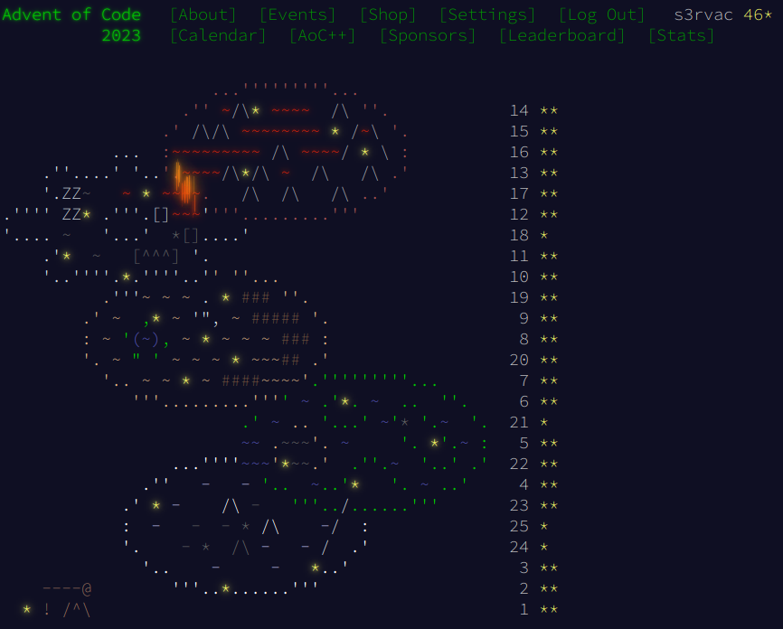

# Advent of Code 2023

My solutions to [Advent of Code 2023](https://adventofcode.com/2023/).

They are implemented in [Python](https://www.python.org/) and tested with CPython 3.12 and PyPy 7.3. The runtimes are based on the faster of the two Python interpreters.

## Solution Table

Note: When originally working on the puzzles in 2023, I only uploaded solutions to the second parts. I have been retrospectively adding solutions to the first parts, but so far, the solutions are not fully complete.

| Day | Puzzle | Solutions | Runtimes |
| ---- | ---- | ---- | ---- |
| 1 | [Trebuchet?!](https://adventofcode.com/2023/day/1) | [part 1](01/aoc01_part1.py), [part 2](01/aoc01_part2.py) | 0.1 seconds, 0.1 seconds |
| 2 | [Cube Conundrum](https://adventofcode.com/2023/day/2) | [part 1](02/aoc02_part1.py), [part 2](02/aoc02_part2.py) | 0.1 seconds, 0.1 seconds |
| 3 | [Gear Ratios](https://adventofcode.com/2023/day/3) | [part 1](03/aoc03_part1.py), [part 2](03/aoc03_part2.py) | 0.1 seconds, 0.1 seconds |
| 4 | [Scratchcards](https://adventofcode.com/2023/day/4) | [part 1](04/aoc04_part1.py), [part 2](04/aoc04_part2.py) | 0.1 seconds, 0.1 seconds |
| 5 | [If You Give A Seed A Fertilizer](https://adventofcode.com/2023/day/5) | [part 1](05/aoc05_part1.py), [part 2](05/aoc05_part2.py) | 0.1 seconds, 0.1 seconds |
| 6 | [Wait For It](https://adventofcode.com/2023/day/6) | [part 1](06/aoc06_part1.py), [part 2](06/aoc06_part2.py) | 0.1 seconds, 0.1 seconds |
| 7 | [Camel Cards](https://adventofcode.com/2023/day/7) | [part 1](07/aoc07_part1.py), [part 2](07/aoc07_part2.py) | 0.1 seconds, 0.1 seconds |
| 8 | [Haunted Wasteland](https://adventofcode.com/2023/day/8) | [part 1](08/aoc08_part1.py), [part 2](08/aoc08_part2.py) | 0.1 seconds, 0.1 seconds |
| 9 | [Mirage Maintenance](https://adventofcode.com/2023/day/9) | [part 1](09/aoc09_part1.py), [part 2](09/aoc09_part2.py) | 0.1 seconds, 0.1 seconds |
| 10 | [Pipe Maze](https://adventofcode.com/2023/day/10) | [part 1](10/aoc10_part1.py), [part 2](10/aoc10_part2.py) | 0.1 seconds, 0.6 seconds |
| 11 | [Cosmic Expansion](https://adventofcode.com/2023/day/11) | [part 1](11/aoc11_part1.py), [part 2](11/aoc11_part2.py) | 0.1 seconds, 0.1 seconds |
| 12 | [Hot Springs](https://adventofcode.com/2023/day/12) | part 1, [part 2](12/aoc12_part2.py) | -, 0.9 seconds |
| 13 | [Point of Incidence](https://adventofcode.com/2023/day/13) | part 1, [part 2](13/aoc13_part2.py) | -, 0.06 seconds |
| 14 | [Parabolic Reflector Dish](https://adventofcode.com/2023/day/14) | part 1, [part 2](14/aoc14_part2.py) | -, 3.3 seconds |
| 15 | [Lens Library](https://adventofcode.com/2023/day/15) | part 1, [part 2](15/aoc15_part2.py) | -, 0.07 seconds |
| 16 | [The Floor Will Be Lava](https://adventofcode.com/2023/day/16) | part 1, [part 2](16/aoc16_part2.py) | -, 1.2 seconds |
| 17 | [Clumsy Crucible](https://adventofcode.com/2023/day/17) | part 1, [part 2](17/aoc17_part2.py) | -, 5.8 seconds |
| 18 | [Lavaduct Lagoon](https://adventofcode.com/2023/day/18) | [part 1](18/aoc18_part1.py), part 2 | 0.3 seconds, - |
| 19 | [Aplenty](https://adventofcode.com/2023/day/19) | part 1, [part 2](19/aoc19_part2.py) | -, 0.08 seconds |
| 20 | [Pulse Propagation](https://adventofcode.com/2023/day/20) | part 1, [part 2](20/aoc20_part2.py)* | -, 0.3 seconds |
| 21 | [Step Counter](https://adventofcode.com/2023/day/21) | [part 1](21/aoc21_part1.py), part 2 | 0.2 seconds, - |
| 22 | [Sand Slabs](https://adventofcode.com/2023/day/22) | part 1, [part 2](22/aoc22_part2.py) | -, 37 seconds |
| 23 | [A Long Walk](https://adventofcode.com/2023/day/23) | [part 1](23/aoc23_part1.py), [part 2](23/aoc23_part2.py) | 0.1 seconds, 15 seconds |
| 24 | [Never Tell Me The Odds](https://adventofcode.com/2023/day/24) | [part 1](24/aoc24_part1.py), part 2 | 0.24 seconds, - |
| 25 | [Snowverload](https://adventofcode.com/2023/day/25) | [parts 1 & 2](25/aoc25.py)* | 7.1 seconds |

\* = tailored to my specific input

## Main Page

