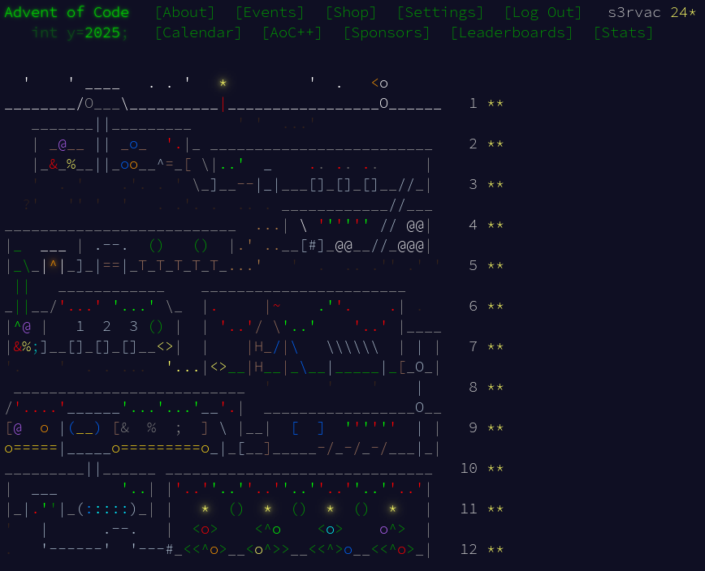

# Advent of Code 2025

My solutions to [Advent of Code 2025](https://adventofcode.com/2025/).

They are implemented in [Python](https://www.python.org/) and tested with CPython 3.13 and PyPy 7.3. The runtimes are based on the faster of the two Python interpreters.

## Solution Table

Note: There were only 12 days this year instead of the regular 25.

| Day | Puzzle | Solutions | Runtimes |
| ---- | ---- | ---- | ---- |
| 1 | [Secret Entrance](https://adventofcode.com/2025/day/1) | [part 1](01/aoc01_part1.py), [part 2](01/aoc01_part2.py) | 0.1 seconds, 0.1 seconds |
| 2 | [Gift Shop](https://adventofcode.com/2025/day/2) | [part 1](02/aoc02_part1.py), [part 2](02/aoc02_part2.py) | 0.5 seconds, 0.8 seconds |
| 3 | [Lobby](https://adventofcode.com/2025/day/3) | [part 1](03/aoc03_part1.py), [part 2](03/aoc03_part2.py) | 0.1 seconds, 0.4 seconds |
| 4 | [Printing Department](https://adventofcode.com/2025/day/4) | [part 1](04/aoc04_part1.py), [part 2](04/aoc04_part2.py) | 0.1 seconds, 0.6 seconds |
| 5 | [Cafeteria](https://adventofcode.com/2025/day/5) | [part 1](05/aoc05_part1.py), [part 2](05/aoc05_part2.py) | 0.1 seconds, 0.1 seconds |
| 6 | [Trash Compactor](https://adventofcode.com/2025/day/6) | [part 1](06/aoc06_part1.py), [part 2](06/aoc06_part2.py) | 0.1 seconds, 0.1 seconds |
| 7 | [Laboratories](https://adventofcode.com/2025/day/7) | [part 1](07/aoc07_part1.py), [part 2](07/aoc07_part2.py) | 0.1 seconds, 0.1 seconds |
| 8 | [Playground](https://adventofcode.com/2025/day/8) | [part 1](08/aoc08_part1.py), [part 1](08/aoc08_part2.py) | 0.8 seconds, 0.8 seconds |
| 9 | [Movie Theater](https://adventofcode.com/2025/day/9) | [part 1](09/aoc09_part1.py), [part 2](09/aoc09_part2.py) | 0.1 seconds, 10 seconds |
| 10 | [Factory](https://adventofcode.com/2025/day/10) | [part 1](10/aoc10_part1.py), [part 2](10/aoc10_part2.py) | 5.2 seconds, 0.8 seconds |
| 11 | [Reactor](https://adventofcode.com/2025/day/11) | [part 1](11/aoc11_part1.py), [part 2](11/aoc11_part2.py) | 0.1 seconds, 0.1 seconds |
| 12 | [Christmas Tree Farm](https://adventofcode.com/2025/day/12) | [parts 1 & 2](12/aoc12.py)* | 0.1 seconds |

\* = tailored to my specific input

## Main Page

